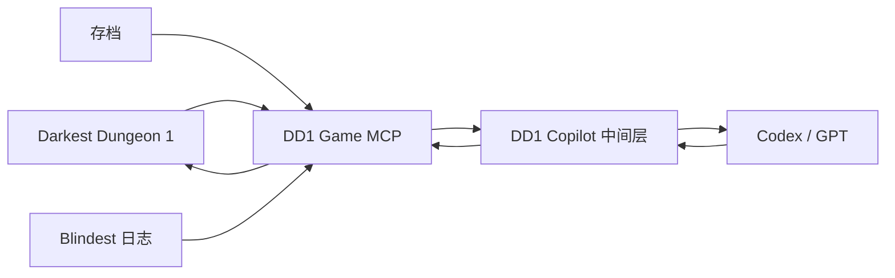

# MCP 与 Copilot 中间层设计

> 2026-09-26 更新：当前 ID 接口与必需参数以 [ID 动作契约](../architecture/003-id-action-contract.md) 为准。编队 `frontToBack` 已改为整数英雄 GUID；本页早期按名字/按键循环的示例属于历史实现。
日期：2026-09-25

## 结论

项目采用与 Spire Copilot 相近的三层结构。Game MCP 保持为信息与命令通道，状态理解和动作验证放在 Copilot 中间层：

## 各层职责

| 层 | 负责 | 不负责 |
| --- | --- | --- |
| DD1 Game MCP | 完整暴露各状态源、原始事件和稳定对象标识；发送基础游戏命令；报告命令是否送达或被底层拒绝 | 推断合法动作、判断动作是否在游戏语义上完成、决定战术 |
| DD1 Copilot | 融合状态、压缩上下文、推断合法动作、等待并验证结算、拒绝过期或重复动作、生成阶段简报 | 选择技能和目标、决定路线或资源使用、自动进行普通战斗 |
| Codex / GPT | 负责城镇、队伍、路线、探索以及每一个战斗回合的决策 | 处理逐帧动画、坐标和输入重试 |

攻略与静态知识只作为按需查询材料，不进入底层动作执行器的自动决策。

## 对 Spire Copilot 的借鉴

Spire Copilot 位于游戏 Mod 提供的 MCP 之前，主要解决：

- 首次完整上下文，随后只给语义差异；
- 等待动画和回合真正结算；
- 防止重复结束回合、敌人死亡后目标索引变化、商店项目重排；
- 将原始状态压缩成适合模型消费的结构；
- 通过 Skill 约束智能体的操作习惯。

DD1 也需要这些能力，并额外需要在中间层处理日志、存档和未来运行时 IPC 之间的对账。

## Game MCP 的目标接口

第一阶段保持接口小而稳定，并尽量无损地提供信息：

1. `get_state(mode)`：返回日常使用的 Blindest 完整事实状态、来源时间和事件游标。
2. `get_events(after_revision)`：返回原始与结构化增量事件。
3. `get_save_snapshot()`：按需复制并解码独立存档检查点；日常状态读取不自动调用。
4. `send_command(command)`：发送基础游戏命令，返回命令是否送达、排队或被底层拒绝。
5. `health()`：报告日志、存档目录、运行时桥和输入通道是否可用，但不触发存档解码。

如果 Blindest 或游戏本身明确报告可选技能、合法目标或输入拒绝，MCP 将这些事实原样暴露。MCP 不根据当前状态自行推断合法动作，也不把“命令已发送”解释成“游戏动作已经成功”。

## Copilot 中间层的目标接口

中间层参考 Spire Copilot，对上层只暴露少量工具：

- `get_state(compact | delta | full)`
- `act(action)`
- `get_briefing(scope)`

其中 `act` 由中间层完成合法性检查、状态版本检查、命令发送、结算等待和结果对账。固定等待只能作为超时边界，不能作为成功判据。

DD1 是回合制游戏，Copilot 无需设置自动战斗评分器。每次轮到英雄时，中间层提供完整状态和合法语义动作，由 Codex 选择技能、目标、移动、物品、跳过回合或撤退。走廊移动、奇物、火把、扎营和战利品也采用同一模式。

## 当前实现

`src/mcp/stdio.ts` 已提供可运行的 Game MCP：

- `get_state`
- `get_events`
- `get_save_snapshot`
- `send_command`
- `health`

它会增量读取 `DD1_BLINDEST_LOG` 指向的日志，并保留事件游标和最近事件。存档解码是显式调用的独立低频信息源。`send_command` 的游戏侧命名管道已经完成真实按键验证。

`src/copilot/stdio.ts` 提供 Copilot v0.2 的模型接口：

- `get_state(compact | delta | full)`；
- `act` 的 revision 过期保护和 requestId 去重；
- 将原始状态整理为当前 `decision`，在战斗回合只给出行动者、敌我单位、技能槽、目标候选和近期结算；
- `open_town_location`、`dismiss_modal`、`use_skill` 与 `cancel_targeting`；
- 将一次 `use_skill` 展开为技能快捷键、目标循环、确认和结算等待；
- 每个机械步骤单独保存输入、回执、起止 revision 与日志证据；
- transport 超时或缺少语义证据时返回 `uncertain`，不自动重发；
- `get_briefing` 的动作历史与故障简报骨架。

游戏侧增加了默认关闭的只读 `inspect_state` 命令。它在游戏主线程枚举当前房间单位、生命、压力、状态效果和行动栏，不产生键鼠输入。Copilot 只在新的英雄行动回合请求一次，并把快照行归约成结构化状态；原始快照行在紧凑输出中只统计数量。

信息筛选采用可审计的三档输出：`compact` 给出当前状态和少量近期决策信息，`delta` 给出 revision 之后的增量，`full` 保留原始缓冲记录并附筛选预览。已知诊断噪声只在 Copilot 中汇总计数；尚未分类的日志不会混同为噪声，而是报告总数并保留近期样本。

离线回放已经覆盖“只读快照 → 模型选择技能和目标 → 中间层完成三个机械步骤 → 战斗结算证据”的整条链路。新 DLL 已用 MSVC 编译且没有部署。下一步是在测试档核对只读快照，再由 Codex 完成一个真实战斗回合。

## 实施顺序

1. [x] 完成只读 MCP 的真实日志握手。
2. [x] 接入命名管道和主线程基础命令。
3. [x] 建立 Copilot 状态压缩、revision 保护、请求去重和分步执行器。
4. [x] 通过只读运行时快照补齐普通战斗的单位与技能槽。
5. [ ] 在测试档完成只读快照和单回合实机验收。
6. [ ] 增加换位、跳过、撤退、战利品和探索动作。
7. [ ] 扩展城镇与远征准备语义动作和决策简报。
