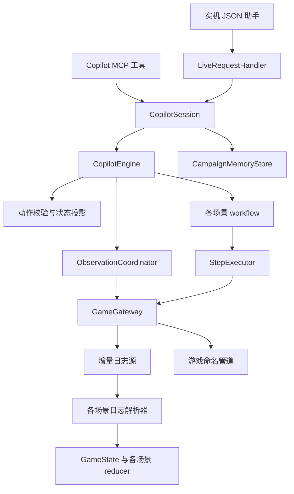

# Copilot 运行结构与维护入口

日期：2026-10-01

本次整理把实机过程中累积的流程拆成可单独维护的模块。战略选择仍由模型负责；中间层负责观察、机械操作、结果核对和长期记录。游戏侧原生接口与存档信息源的边界沿用 [ID 动作契约](003-id-action-contract.md)。

## 调用关系

Game MCP 的原始信息与命令通道继续位于 `src/mcp/`。图中的 MCP 是模型使用的 Copilot MCP，位于 `src/copilot/create-server.ts`。

## 文件职责

| 入口 | 职责 |
| --- | --- |
| `src/copilot/session.ts` | 两个模型入口共用的动作事务、回合交接、战斗投影、档案记录和关闭流程 |
| `src/copilot/engine.ts` | revision 校验、请求去重、流程分派、动作记录、战斗回合等待 |
| `src/copilot/observation.ts` | 串行观察、按上下文补充快照、强制刷新，以及既有的进门后观察恢复 |
| `src/copilot/step-executor.ts` | 提交一次基础命令，核对传输回执与语义证据；缺证据时报告 uncertain |
| `src/copilot/workflows/` | 城镇、准备、探索、事件、背包、战利品、战斗、营地、结算及界面恢复 |
| `src/copilot/workflow-context.ts` | workflow 能使用的游戏通道、超时配置和步骤执行器 |
| `src/copilot/validate-action.ts` | 纯动作合法性检查，不发送输入 |
| `src/copilot/decision.ts`、`state-view.ts` | 纯决策事实及 compact/delta/full 投影 |
| `src/copilot/live-handler.ts`、`state-presenter.ts` | 实机 JSON 协议与地图基线呈现 |
| `src/cli/live-session.ts` | 类型检查覆盖的实机进程入口；旧 `.mjs` 只负责启动编译产物 |
| `src/blindest/parsers/` | 按场景识别日志事件；信封及路由保留在 `parse-line.ts` |
| `src/state/game-state.ts`、`reducers/` | 全局事实状态及各场景归约；所有场景共享 revision 和会话重置边界 |
| `src/copilot/campaign-memory.ts` | 数据库生命周期、状态观察和写入 |
| `src/copilot/memory/` | schema、只读查询、Markdown 导出 |
| `tests/copilot-*.test.ts`、`tests/helpers/` | 按场景划分的回归测试及共用命令传输桩 |

`CombatState`、`initialCombatState`、`reduceCombatState` 的旧文件路径和公开导出保留为兼容别名。内部代码使用范围更准确的 `GameState`；SQLite schema 未变化，无需迁移已有档案。

## 运行约定

- MCP `act`、实机 `act` 和 `act_current` 共用一次动作与回合交接。战斗动作默认最长等待 30 秒，可显式指定 1–60 秒；收到下一名稳定、已完成观察的可操作英雄后立即返回。
- 相同请求可重取同一动作及交接结果。缓存保留最近 100 个事务；复用 ID 改动作或 revision 会被拒绝。实机省略 revision 时，重取同一请求仍使用首次提交的 revision。
- `refresh_state`/`refresh` 必须收到新的完整观察。通道不可用、输入被拒绝、日志不可用或快照超时会明确失败；实机首个动作因此不会被过期日志放行。
- `summary` 保留 compact 中的决策资料，战斗继续使用 tactical 投影。delta 不再额外截成最后 16 条；游标失效时回到 compact 重建基线。
- 地图首次发送完整拓扑；移动只报告位置和访问变化。新发现或新的远征需要时重新发送拓扑，路线由模型选择。显式 `full` 保留诊断内容。
- 两个 Copilot 进程不能同时拥有同一个游戏命令管道。所有权由独立的本地监听端点持有，正常退出后释放；启动助手前先停止该游戏对应的另一 Copilot。
- `stop`、输入 EOF、信号或输出管道断开会关闭会话、停止后续命令、唤醒轮询并关闭数据库。已在提交中的命名管道请求仍受传输超时约束，不会因退出而重新发送。

## 修改与验证顺序

新增游戏事实：事件类型 → 场景 parser → 场景 reducer → 状态/决策投影。新增动作：schema → 合法性检查 → 场景 workflow → 引擎分派。协议呈现只在对应适配器调整，公共事务逻辑放在 session。

本轮保留原有 89 项测试，并新增刷新失败、回合交接去重、退出取消、地图基线、完整诊断、增量完整性及进程生命周期验证。另用已有实机采集和测试字符串与改造前版本逐条比较：1,067 行、742 个已识别事件、100 类事件的解析与归约结果一致。

这些证据覆盖离线行为和实际 Node 子进程。游戏内的回合响应速度、场景切换与连续远征仍需下一次实机验收；本次没有修改或部署 DLL。
