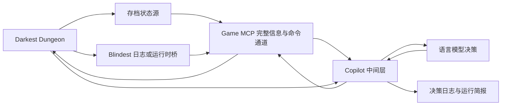

# DD1 Copilot 总体规划

项目的主要产品是面向模型的 Copilot：提供紧凑且充分的决策状态、语义动作、执行核对和长期战役记忆。Game MCP 与游戏侧桥接是其可替换的事实和输入适配层。

> 状态：M2 单回合闭环离线实现完成，等待测试档实机验收
> 创建日期：2026-09-24
> 项目目标：让语言模型能够通过结构化状态和语义动作，真实地操作本地《Darkest Dungeon 1》，并由模型独立完成游戏决策。

## 1. 项目愿景

本项目为《Darkest Dungeon 1》建立一套本地智能体桥接系统。桥接层负责提供可靠的“眼睛、手脚和动作回执”，模型负责战斗、探索、队伍建设、资源管理和风险判断。

项目追求的体验是：模型确实在玩一局真实游戏，并承担自己过去决策产生的后果。游戏攻略、规则数据和历史日志可以作为参考，但底层程序不替模型决定技能、目标、路线、补给、升级或撤退。

## 2. 核心原则

### 2.1 决策归属

以下决定必须由模型作出：

- 战斗技能和目标选择；
- 队伍站位与换位；
- 是否治疗、拖延、撤退或继续冒险；
- 地牢路线、古物交互和战利品取舍；
- 扎营技能及使用对象；
- 任务、队伍、补给和饰品配置；
- 建筑、技能、装备、怪癖和减压管理；
- 长期资源分配。

底层允许自动处理没有战略含义的操作：

- 等待动画和界面切换完成；
- 把光标移动到模型已经指定的对象；
- 执行单选项确认；
- 验证输入是否被游戏接受；
- 检测旧状态并拒绝过期指令；
- 在输入失败时重新读取状态和恢复界面；
- 生成日志、统计和战后简报。

### 2.2 状态优先于时间等待

动作完成条件应当是可观察的游戏状态变化，例如当前行动者改变、生命值变化、目标死亡或界面阶段切换。固定等待若干秒只能作为超时保护，不能作为成功判据。

### 2.3 每个动作可追溯

每次动作必须记录：

- 决策依据的状态版本；
- 模型选择的语义动作；
- 实际执行的输入；
- 动作后的状态变化；
- 成功、失败或不确定；
- 失败原因及恢复过程。

### 2.4 原始存档安全

- 开发阶段只使用独立测试档；
- 读取前复制快照，避免读取半写文件；
- 自动保留关键节点备份；
- 不直接编辑正式存档；
- 所有可能影响进度的实验必须能够回滚。

## 3. 总体架构



系统分成五个逻辑层：

1. **状态采集层**：存档、Blindest 调试日志、未来的运行时 IPC，必要时辅以截图。
2. **Game MCP 层**：完整暴露各来源状态、结构化事件、来源游标和基础命令通道，不推断策略或动作结果。
3. **Copilot 中间层**：融合来源、生成决策状态、推断合法动作、检查过期状态、等待结算并生成简报。
4. **动作执行层**：由 Game MCP 把基础命令转换成游戏内部 SDL 输入或外部输入，并只报告传输与底层接受情况。
5. **模型决策层**：负责商店、队伍、路线、探索以及每一个战斗回合的选择。

## 4. 数据来源

### 4.1 存档状态源

计划参考 `darkest-dungeon-mcp`、`DarkestDungeonSaveEditor` 和 `DarkestDungeonBot` 的经验，实现：

- 监听 DD1 存档文件变化；
- 等待文件大小和修改时间短暂稳定；
- 将相关文件复制到临时快照目录；
- 解码 `persist.raid`、`persist.roster`、`persist.map` 等文件；
- 验证关键字段完整性；
- 与上一个有效状态生成语义差异；
- 解码失败时保留旧状态并重试。

存档负责提供可靠的战役、城镇、英雄、地图、背包和战斗检查点，并作为实时日志或未来运行时接口的交叉验证与故障恢复来源。它不参与逐帧或逐输入决策。

存档通道采用“监听变化、按需解码”：

- 平时只检查文件元数据，不固定频率复制全部档案；
- 仅在正式 `persist.*.json` 发生变化并稳定后复制相关文件；
- 进入战斗、战斗结束候选、房间/城镇切换、实时事件超时或模型显式核对时触发解码；
- 同一批文件哈希未变化时复用上次结果；
- 战斗中不因每条日志事件重复启动 Java 解码器。

首场实测 8 分钟内保存 62 个变化文件版本，总量约 345 KiB，文件复制本身不是性能瓶颈；需要控制的是 Java 解码进程启动次数和存档写入尚未稳定时的竞态。

### 4.2 Blindest 调试日志

项目先通过开启调试模式后的 `ddaccess-debug.log` 完成信息勘察，确认其中包含：

- 当前界面和焦点变化；
- 战斗开始、行动者变化和技能结算；
- 闪避、暴击、抵抗和状态效果；
- 战利品、古物、陷阱和界面弹窗；
- 输入队列和失败诊断。

日志是 M1 战斗观察的低延迟主输入；存档负责随后确认持久结果。日志不单独作为战役长期状态的唯一依据。

### 4.3 Blindest 运行时桥

v0.10 release 已明确项目正式开源，并允许任何人检查或以任何方式修改代码。本地测试副本已经增加默认关闭的 IPC 原型。由于仓库尚未提供项目本体的具体许可证文本，修改版源码或二进制的公开再发布继续单独处理：

```text
Blindest DLL
    ↕ JSONL
Windows Named Pipe
    ↕
独立 MCP 服务
```

运行时桥只承担状态和动作传输，不在 DLL 中运行模型或编写战斗策略。

当前原型已经支持：

- 当前用户 ACL 保护的 Windows Named Pipe；
- `key_press` 与 `click_element` 基础命令；
- 游戏主线程上的只读 `inspect_state`，输出敌我单位、生命、压力、状态效果和行动栏。

后续预期输出：

- 游戏版本指纹；
- 当前场景与 UI 阶段；
- 当前焦点和屏幕可见元素；
- 英雄、怪物、技能、物品和地图对象；
- 当前合法动作；
- 战斗及界面事件；
- 合成输入队列状态；
- 动作完成或拒绝通知。

### 4.4 截图与 OCR

截图只作为诊断和缺口补充：

- 验证模型状态与玩家看到的画面一致；
- 识别尚未被存档、日志或运行时桥覆盖的界面；
- 保存错误现场。

不把固定坐标图像识别作为主要控制方式。

## 5. 中间层统一状态模型

Game MCP 提供各来源的完整数据和游标；Copilot 中间层将它们融合为 `GameState`，至少包含：

```ts
interface GameState {
  revision: number;
  observedAt: string;
  phase: GamePhase;
  actionable: boolean;
  campaign?: CampaignState;
  town?: TownState;
  embark?: EmbarkState;
  raid?: RaidState;
  combat?: CombatState;
  modal?: ModalState;
  sources: SourceStatus[];
}
```

初步阶段枚举：

```text
frontend
campaign_loading
town.idle
town.building
embark.quest_selection
embark.party_selection
embark.provisioning
raid.exploration
raid.curio
raid.trap
raid.loot
raid.camping
combat.animating
combat.awaiting_action
combat.target_selection
combat.finished
raid.results
modal.confirmation
unknown
```

### 5.1 状态版本

只有发生影响决策的语义变化时才增加 `revision`。文件时间戳变化、重复日志或动画帧本身不应产生新版本。

语义变化包括：

- 行动者改变；
- 生命、压力、火把、资源或状态效果变化；
- 单位生成、死亡或换位；
- 可用技能或合法目标改变；
- 场景、界面阶段或弹窗改变；
- 地图、背包、任务和战利品变化。

## 6. Game MCP 工具设计

Game MCP 第一版保持五个小工具，Copilot 对模型保持三个工具。

### 6.1 `get_state`

```text
get_state(mode = structured | full)
```

- `structured`：完整结构化字段，省略重复的原始日志文本；
- `full`：结构化字段加原始来源数据，用于诊断和重新对账。

MCP 返回来源时间、来源游标和健康状态。面向模型的压缩状态由 Copilot 中间层生成。

### 6.2 `get_events`

```text
get_events(after_revision, limit, include_raw)
```

返回指定游标之后的事件。原始信息与结构化结果均可查询，不在 MCP 内生成策略含义。

### 6.3 `send_command`

```text
send_command(command)
```

发送选择技能、选择目标、移动、确认、取消等基础命令。返回值只说明命令是否送达、排队或被底层明确拒绝，不宣称游戏语义动作已经完成。

### 6.4 `health`

报告日志、存档、运行时 IPC 和输入通道的可用性、最后更新时间和错误。

## 7. Copilot 中间层与语义动作

中间层向模型提供：

- `get_state(compact | delta | full)`；
- `act(action, based_on_revision)`；
- `get_briefing(scope)`。

中间层负责推断可提交动作，检查状态版本与目标，调用基础命令，然后根据新状态判断 `success`、`failure` 或 `uncertain`。一次语义动作可以包含多个机械步骤；每一步都保存起止 revision、传输回执与语义证据，任一步不确定就停止。它还负责状态压缩、错误恢复和简报，但不为模型选择技能、目标或路线。

当前已实现：

```text
open_town_location(location_id)
dismiss_modal()
use_skill(skill_slot, target_side, target_slot)
pass_turn()
cancel_targeting()
```

### 7.1 战斗动作

```text
use_skill(actor_id, skill_id, target_ids)
move(actor_id, destination_rank)
pass_turn(actor_id)
retreat()
```

### 7.2 探索动作

```text
move_to_room(room_id)
advance_tile()
interact_with_curio(curio_id, item_id?)
disarm_trap(hero_id, trap_id)
use_inventory_item(item_id, target_id?)
take_loot(item_ids)
discard_item(item_id, amount)
camp()
```

### 7.3 城镇动作

```text
select_quest(quest_id)
assign_party_slot(hero_id, rank)
equip_trinket(hero_id, trinket_id, slot)
buy_provision(item_id, amount)
upgrade_building(building_id, upgrade_id)
upgrade_skill(hero_id, skill_id)
upgrade_equipment(hero_id, equipment_id)
assign_treatment(hero_id, treatment_id)
embark()
```

动作参数必须使用稳定实体 ID，避免依赖屏幕坐标和当前列表位置。

## 8. 动作生命周期

```text
模型观察 revision=42
    ↓
模型提交语义动作
    ↓
执行器校验阶段、版本和合法参数
    ↓
动作被转换为内部 SDL 输入或外部键盘输入
    ↓
状态采集层等待可观察变化
    ↓
生成 revision=43 和语义差异
    ↓
向模型返回动作回执
```

建议回执格式：

```json
{
  "action_id": "a-173",
  "based_on_revision": 42,
  "status": "executed",
  "after_revision": 43,
  "observed_changes": [
    "plague_doctor.used_skill=noxious_blast",
    "enemy:2.hp=0",
    "enemy:2.dead=true",
    "current_actor=crusader"
  ]
}
```

发生 `ambiguous` 时不得继续排队动作。系统应读取完整状态、清空待执行输入，并进入对账流程。

## 9. 决策日志和简报

每次运行建立独立目录：

```text
runs/<campaign>/<timestamp>/
├── metadata.json
├── observations.jsonl
├── decisions.jsonl
├── actions.jsonl
├── events.jsonl
├── errors.jsonl
└── summary.md
```

战斗记录示例：

```text
第 3 回合
观察：后排敌人准备压力攻击，瘟疫医生可以同时攻击两个后排位置。
决定：使用致盲毒气，目标为敌方 3、4 号位。
执行：成功。
结果：一名敌人眩晕，另一名抵抗；下一行动者为十字军。
```

日志需要区分：

- 模型判断错误；
- 状态信息缺失；
- 动作接口表达不足；
- 输入执行错误；
- 游戏状态刷新延迟；
- 游戏版本或内存偏移不兼容。

## 10. 全程模型接管原则

项目不设置独立的自动战斗 Bot。每当游戏进入需要选择的节点，中间层向模型提供完整的当前事实、合法动作和 revision；模型逐步决定技能、目标、移动、治疗、物品、火把、奇物、路线、扎营、战利品和撤退。

中间层可以处理输入翻译、动画等待、状态对账、重复请求拦截和故障恢复，但不能根据隐藏评分函数替模型选择动作。决策记录应保存模型当时看到的状态、选择理由、实际输入与结算结果。

## 11. 分阶段里程碑

### M0：数据勘察

目标：确认存档和 Blindest 日志各自覆盖的信息与刷新时机。

- 创建和备份测试存档；
- 开启 Blindest 调试日志；
- 手动完成一场普通战斗；
- 记录进入战斗、轮到英雄、选择技能、结算、死亡和战斗结束；
- 对比存档、日志与实际画面；
- 形成字段覆盖表和延迟测量结果。

验收标准：明确第一版状态模型所需的字段来源和已知缺口。

### M1：只读 MCP 观察器

- 完成事件驱动的安全存档快照和按需解码；
- 以日志增量读取作为战斗主输入；
- 输出完整结构化来源状态与原始诊断信息；
- 实现事件增量、来源健康检查和游标。

验收标准：玩家手动操作时，MCP 能无损提供整场战斗需要的状态变化。

### M2：单回合闭环

- 在 Game MCP 实现技能、目标和界面操作的基础命令发送；
- 建立 Copilot 中间层；
- 在中间层实现合法动作推断和技能、目标的语义选择；
- 在中间层实现动作回执、状态对账、超时、失败和歧义处理。

验收标准：模型可以可靠完成一个战斗回合，且系统能够证明动作结果。

### M3：完整普通战斗

- 覆盖伤害、治疗、压力、眩晕、位移、标记、持续伤害和死亡之门；
- 覆盖敌人死亡、增援、回合结束和战斗结束；
- 生成完整决策日志和战斗简报。

验收标准：模型无需人工修正光标即可独立完成一场普通战斗。

### M4：地牢探索

- 地图、侦察、走廊和房间导航；
- 火把、背包、陷阱、古物和战利品；
- 扎营、任务完成和撤退；
- 状态恢复和界面异常处理。

验收标准：模型可以完成一场短任务并安全返回城镇。

### M5：城镇与远征准备

- 任务选择和队伍编成；
- 饰品、技能、装备和补给；
- 建筑升级、治疗和减压；
- 周结算与资源管理。

验收标准：模型能够从一个城镇周开始，自主准备并完成下一次远征。

### M6：连续战役

- 跨周记忆和目标管理；
- 风格参数调整；
- 失败分析和策略修正；
- 存档恢复和长时间稳定性；
- 老兵难度实战。

验收标准：模型能够连续管理多个游戏周，并对自己的长期决策负责。

## 12. 验证方法

测试应以玩家实际看到的游戏为准：

- 对照画面检查状态字段；
- 保存关键阶段截图；
- 比较动作前后存档；
- 检查 Blindest 实时日志；
- 验证实际按键和 UI 焦点；
- 回放 JSONL 决策日志；
- 人工标记误读、误操作和漏事件。

优先建立契约测试：Game MCP 验证信息完整性和命令传输；Copilot 验证合法动作、版本拒绝、状态差异和动作回执。涉及游戏运行时的测试必须在真实 DD1 客户端中进行。

## 13. 风险与应对

| 风险 | 影响 | 应对 |
|---|---|---|
| Blindest 未列出具体许可证文本 | 本地修改已有明确许可，但修改版源码和 DLL 的再发布条件仍不完整 | 独立发布 MCP/Copilot；上游源码和修改版 DLL 暂不并入公开仓库，继续询问再发布条款 |
| 游戏更新导致内存偏移失效 | 注入层崩溃或读错数据 | 校验 PE 指纹；未知版本拒绝运行；保留存档降级路径 |
| 存档写入延迟 | 动作后暂时看不到变化 | 使用日志或 IPC 补充；以状态谓词和超时共同判断 |
| 读取半写存档 | 解码失败或状态矛盾 | 稳定窗口、临时副本、校验和重试 |
| UI 焦点失配 | 选错技能或目标 | 使用稳定实体 ID；执行前后校验；歧义时停止 |
| Mod 改变数据结构或界面 | 动作和规则不再匹配 | 保存 Mod 清单；首期只支持原版和官方 DLC |
| 模型上下文过大 | 延迟和成本增加 | 紧凑观察、语义差异和按需 `inspect` |
| 自动操作损坏进度 | 测试档丢失 | 自动备份、独立档位和关键节点快照 |

## 14. 项目目录规划

```text
dd1-agent-bridge/
├── 总体规划.md
├── apps/
│   └── mcp-server/
├── packages/
│   ├── state-schema/
│   ├── save-provider/
│   ├── blindest-log-provider/
│   ├── state-fusion/
│   ├── action-executor/
│   └── run-journal/
├── native/
│   └── blindest-bridge/
├── fixtures/
│   └── saves/
├── docs/
│   ├── protocol.md
│   ├── state-fields.md
│   └── experiments/
└── references/
    └── Blindest-Dungeon/
```

`references/Blindest-Dungeon` 保持为独立 Git 仓库，不直接混入本项目源码。v0.10 已允许检查和任意修改；在具体再发布条款明确以前，不在我们的公开仓库中复制其源文件或发布修改后的二进制。

## 15. 当前参考仓库状态

### Blindest Dungeon

- 仓库：<https://github.com/Vicorin/Blindest-Dungeon>
- 本地位置：`references/Blindest-Dungeon`
- 克隆分支：`main`
- 当前提交：`8b2d11bb48067957a7b1f48dfbe62bf76142e0f4`
- 版本包：`BlindestDungeon-v0.10.zip`
- 源码位置：`Source/Mod/src`
- 开源声明：v0.10 release 写明项目正式开源，任何人可以检查或以任何方式修改代码；
- 具体许可证：仓库根目录仍未发现项目本体的 `LICENSE` 或 SPDX 标识；Prism 及其依赖的许可证只覆盖对应第三方组件；
- 再发布状态：已向作者询问，等待确认修改版源码与 DLL 的公开分发条件。

值得优先审阅的文件：

- `Source/Mod/src/game/offsets.h`：版本指纹、RVA 和结构偏移；
- `Source/Mod/src/core/gameread.cpp`：受保护的内存读写；
- `Source/Mod/src/core/hooks.cpp`：运行时钩子；
- `Source/Mod/src/input/synth.cpp`：SDL 合成输入；
- `Source/Mod/src/input/layout.cpp`：UI 元素和布局；
- `Source/Mod/src/raid/actionbar.cpp`：战斗技能和行动栏；
- `Source/Mod/src/raid/dungeonview.cpp`：地牢和战斗对象；
- `Source/Mod/src/raid/combattext.cpp`：战斗事件文本；
- `Source/Mod/src/raid/raidmap.cpp`：地图；
- `Source/Mod/src/town/embark.cpp`：任务选择；
- `Source/Mod/src/town/provision.cpp`：补给；
- `Source/Mod/src/town/party.cpp`：队伍编成。

## 16. 近期行动清单

1. [ ] 等待 Blindest 作者确认修改版源码与 DLL 的再发布条款；
2. [x] 建立 TypeScript 项目骨架和首版战斗状态 schema；
3. [x] 定位本机 DD1 安装路径与存档档位；
4. [x] 为测试档建立只读备份和实机采集流程；
5. [x] 安装 Blindest v0.10，并确认当前 DD1 二进制与其版本指纹匹配；
6. [x] 通过 `DarkestAccess.exe` 完成运行兼容性验证并确认生成 `ddaccess-debug.log`；
7. [x] 完成一场手动普通战斗的数据采集；
8. [x] 整理存档与日志字段覆盖表；
9. [x] 决定 M1 的最小战斗事件与状态字段；
10. [x] 实现只读日志观察与 Game MCP；
11. [x] 实现命名管道基础命令并实机打开驿站马车；
12. [x] 实现 Copilot 紧凑状态、revision、去重和分步执行器；
13. [x] 实现战斗只读 `inspect_state` 并通过离线 DLL 编译；
14. [ ] 在测试档实机核对 `inspect_state`；
15. [ ] 由模型通过 `use_skill` 完成一个真实战斗回合。

## 17. 首个可玩版本的边界

首个版本只支持：

- Windows；
- Steam 版 DD1 当前受支持构建；
- 原版英雄和普通战斗；
- 一个独立测试存档；
- 单场普通战斗；
- 技能、目标、换位和撤退；
- 完整状态、语义差异、动作回执和战斗简报。

首个版本暂不要求：

- 全部 DLC；
- 社区职业与大型 Mod；
- 城镇自动管理；
- 连续战役；
- Boss 和特殊战斗；
- 通用图像识别控制；
- 修改或写入游戏存档。

达到首个版本后，再依据真实运行日志扩展范围。
